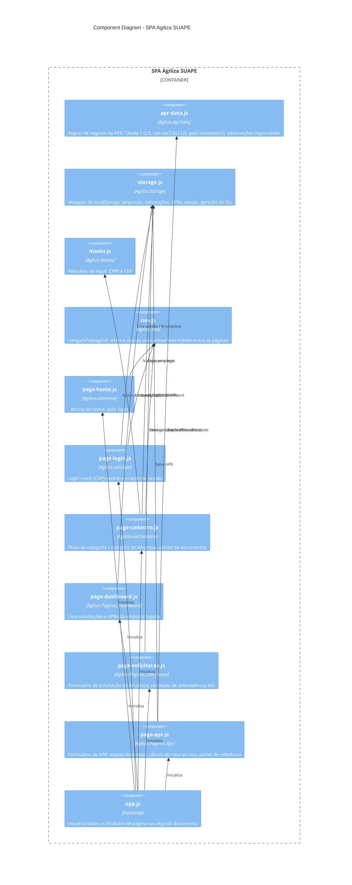

# Component Diagram — SPA Agiliza SUAPE

Decomposição interna do container "SPA Agiliza SUAPE" nos módulos JS reais do repositório (`js/*.js`, carregados nessa ordem pelo `index.html`).

## Notas
- Todos os módulos publicam no namespace global `window.Agiliza` (padrão de "revealing module" simples, sem bundler).
- `apr-data.js` e `storage.js` são os únicos componentes sem dependência de DOM — puras regras de negócio e persistência, reutilizáveis por qualquer página.
- `nav.js` é o único ponto que manipula transição entre views (`.view-active` / `.view-hidden`), evitando lógica de navegação duplicada em cada página.
