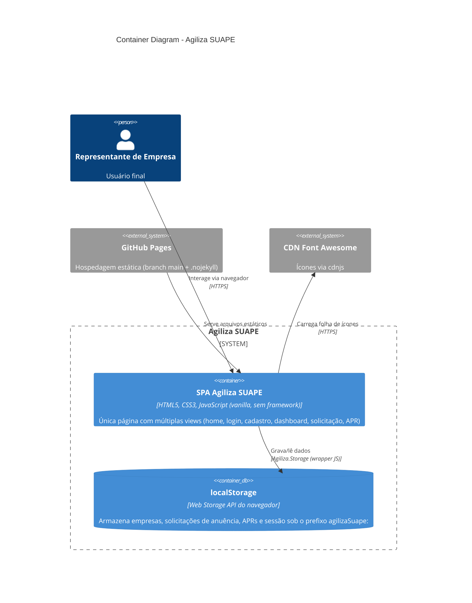

# Container Diagram — Agiliza SUAPE

Como o sistema é decomposto em partes executáveis/implantáveis.

## Notas
- Não existem containers de servidor de aplicação, API ou banco de dados relacional/NoSQL — a "camada de dados" é inteiramente client-side (`localStorage`, acessado através do módulo `js/storage.js`).
- A SPA é um único artefato implantável: `index.html` + `style.css` + pasta `js/` + `assets/`.
