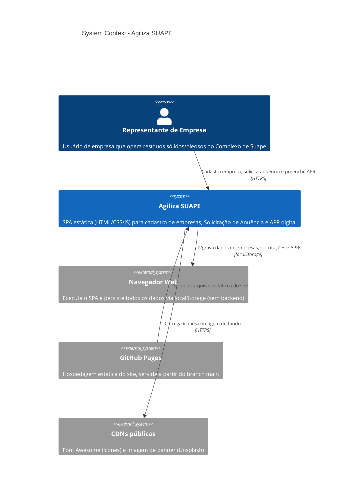

# System Context — Agiliza SUAPE

Visão de mais alto nível: quem usa o sistema e com que sistemas externos ele troca dados.

## Notas
- Não há backend, API ou banco de dados — todo o estado (empresas, solicitações de anuência, APRs, sessão) vive no `localStorage` do próprio navegador do usuário.
- O "sistema" Agiliza SUAPE é servido inteiramente como arquivos estáticos pelo GitHub Pages.
