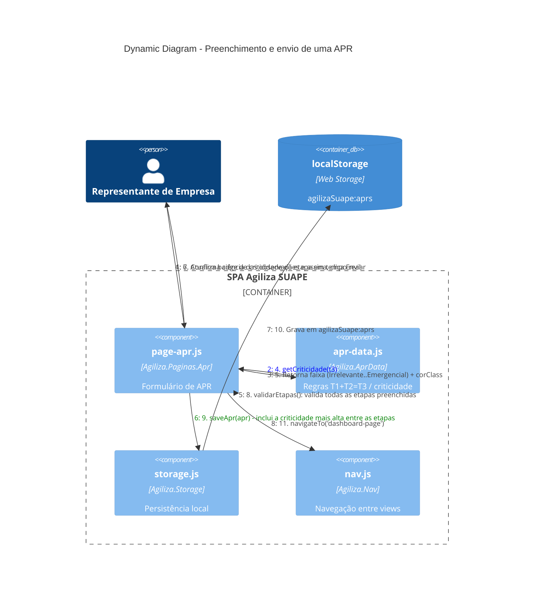

# Dynamic Diagram — Fluxo "Nova APR"

Fluxo de requisição numerado para o cenário mais complexo do sistema: preenchimento de etapas da APR com cálculo de risco ao vivo e envio.

## Notas
- Os passos 1-6 se repetem para cada etapa adicionada dinamicamente (`adicionarEtapa()` em `page-apr.js`), já que o cálculo de risco é recalculado a cada mudança de T1/T2 via listeners `input`/`change`.
- A criticidade "pior caso" entre todas as etapas é a que aparece no card resumido do dashboard.
